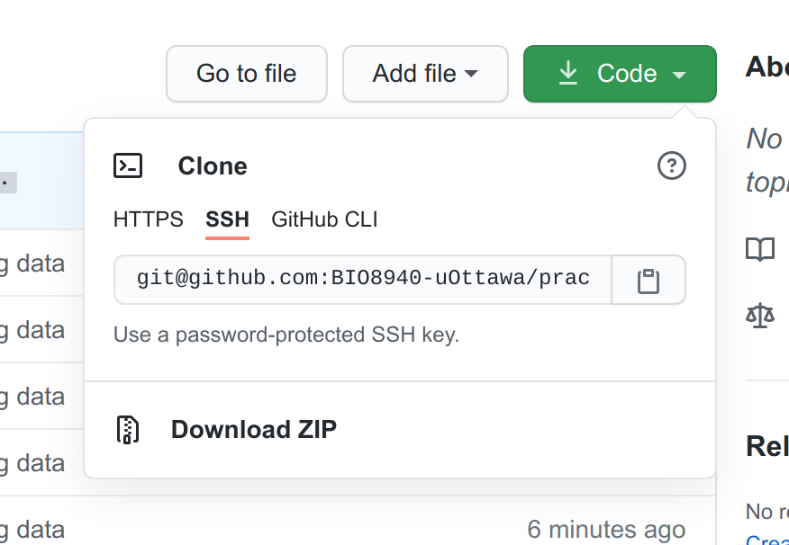

# Data for BIO8940 practicals

This repository has all datasets used in the practicals of the course **BIO8940 Advanced Stats and Open Science**. In addition, extra examples as well as all `R` code used in the book are provided in *.R* files.

The easiset way to download the dat is simply to click on the big green `code` button and select *Download ZIP*. 

After downloading the *.zip* file, extract it to the location of your choice. My recommendation is to extract it in a folder where you will be saving all your `.R` and `.Rmd` scripts for the course. After extracting, rename the extracted folder from `practical_data-main` to `data`. 

